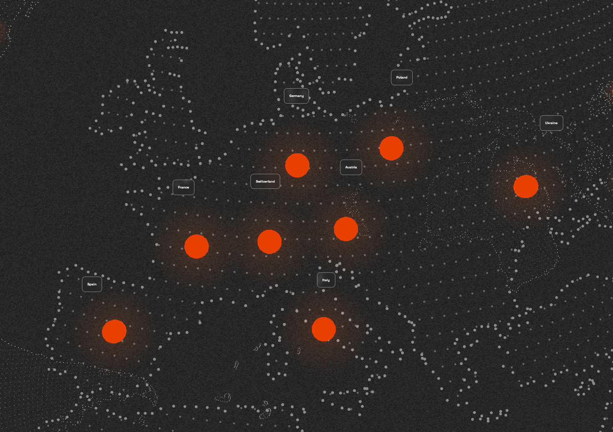
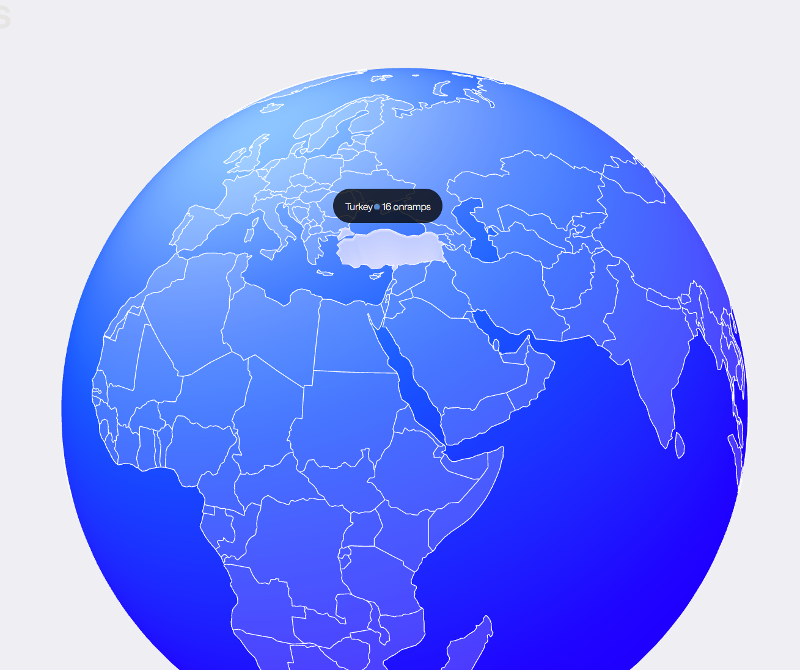

Quero criar um site parecido com esse https://www.sergiomusel.com/travelmap
É um globo em 3D renderizado usando three.js onde a pessoa colocou todos os lugares que ela já foi. Ele gira sozinho vagarosamente, e dá pra girar/dar zoom com o mouse (botão esquerdo gira, scroll dá zoom)
No meu caso, eu quero criar um globo para que eu marque todos países e regiões dos quais conheci pelo menos 1 pessoa no VRChat.
O intúito é criar um site minimalista com um globo giratório que mostra todas regiões do mundo que já conheci pelo menos 1 pessoa, onde cada região eu posso adicionar o nome das pessoas.
Quero que tenha uma inteligência onde o(s) nome(s) só aparece quando der zoom o suficiente no globo e não fique muitos nomes aglomerados (principalmente em regiões com países pequenos como a Europa).
O globo deve ser nesse estilo parecido mas deve delimitar as bordas dos países. Se olhar esse  do site da pessoa, verá que os países não possuem suas bordas.
Quero que seja possível que eu (no código/backend) consiga facilmente acrescentar e dar highlight em uma nova região.
Os países quero que haja todos, mas de regiões/estados quero que mostre somente as desses países:
- Brazil, Argentina, EUA, Canada, Australia, England, Germany, Italy, France, Spain, Norway, Sweden, Finland, Japan.

Achei um outro website com um globo: https://onramper.com/
O estilo em si não gostei muito, mas gostei que mostra o nome do país só quando passa o mouse em cima. Quero isso no nosso globo.
Então o globo será um dot-matrix com as bordas delimitadas, mas quero que os nomes dos países apareçam só quando passar o mouse por cima. 